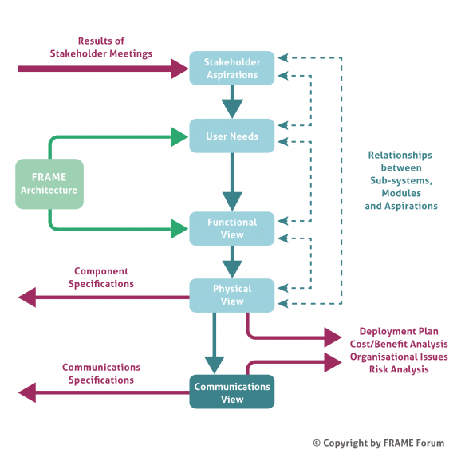
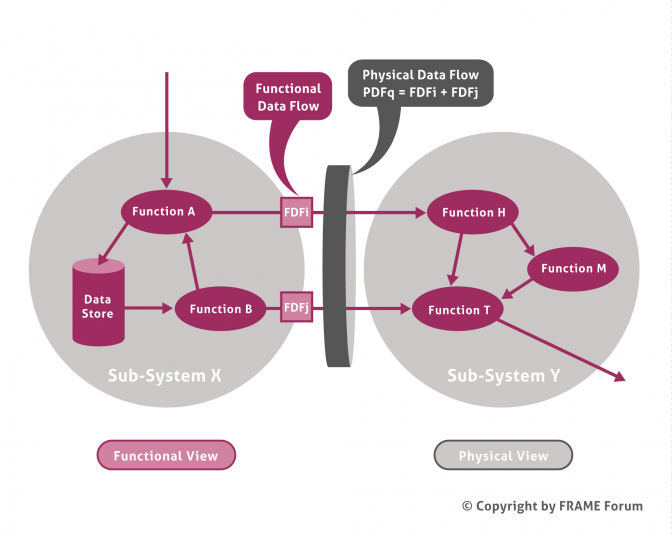

# Creating an ITS Architecture using FRAME

The methodology for creating an ITS Architecture from the FRAME Architecture is illustrated in the figure below. The use of particular technologies or supplier products is not included in the FRAME Architecture. This is important for two reasons. Firstly the ITS Architectures created using the methodology will not become obsolete through advances in technology, or product development, and secondly it opens up the possibility for the development of new technologies to enable particular functionality to be provided.

## Stakeholder Aspirations

Stakeholder Aspirations are statements that express the expectations and desires of the various stakeholders for the services that the ITS implementation will provide. They should be written by the stakeholders, but experience has shown that help is often needed from the architecture team. There are four classes of stakeholder, as follows:

 - Want ITS – this class comprises organisations that need ITS services to enable their road networks to be used safely and efficiently. It also includes public transport operators and freight operators where ITS can enable them to improve the efficiency with which they move people and goods.
 - Use ITS – this class comprises the end users who make use of the ITS services and/or operate the equipment. It includes travellers on a multi-modal journey as well as all classes of vehicle driver; freight shippers; pubic transport mangers and specialist system operators.
 - Rule ITS – this class represents those who provide regulations and standards. It includes national governments and the various Standards making bodies.
 - Make ITS – the class comprises the equipment and system manufacturers, communications providers and the system integrators.

Service providers, e.g. travel information and trip planning, may be in one or more of the Want, Use and Make ITS classes.

## User Needs
It is normal to find that the Stakeholder Aspirations will have been written in a variety of styles. Sometimes they can also be obscure and inconsistent. It is thus necessary to re-write them in a consistent manner that is suitable for the next stage in the process. The result is a set of User Needs that express the Stakeholder Aspirations in a consistent and stylised manner whose meaning is clear and whose properties are testable.

The KAREN project produced a set of about 550 User Needs to cover the ITS applications and services being considered for implementation at the end of the 1990’s. The FRAME projects have then added to them with, most recently, the E-FRAME project adding about 230 User Needs for Cooperative Systems. Thus, when using the FRAME Architecture, the architecture team needs to write new User Needs only very occasionally. Most of the time the User Needs required can be selected from the existing list.

## Functional View
The FRAME methodology uses the term “Views” for the parts that make up the FRAME Architecture and its resultant ITS Architectures. This follows the recommendations of IEEE 1471. The alternative term of “Architecture” is still used elsewhere, but we feel that an architecture made up of views is more comprehensible than one that is made up of architectures.

A Functional View (sometimes called a Logical View) shows the functionality that will be required to fulfil the User Needs, and hence the Stakeholder Aspirations. When using the FRAME Architecture the Functional View is shown as Data Flow Diagrams that contain functions, data stores and terminators, and the data that flows between them. Each of these is provided with its own description which, in the case of functions, includes statements explaining what they do. Since the FRAME Architecture comprises a Functional View that satisfies all of its User Needs, the architecture team only has to select those parts of it that serve the User Needs that have been mapped to the Stakeholder Aspirations. New functions etc. are only needed for Stakeholder Aspirations that have required new User Needs to be added.

Another important part of the Functional View is the Context Diagram. This shows the ITS as a single item and the links needed by the functionality contained within it to communicate with the entities outside it. It is useful for two reasons. Firstly it enables the system boundary to be defined showing what is inside the ITS and what is not, and thus what is the responsibility of the ITS Engineers (and hence what its not!). Secondly it enables definitions to be produced of the way in which the functionality inside the ITS expects the outside entities to behave. These outside entities are called Terminators, and either obtain data for the ITS or provide outputs to end users. The same Context Diagram is also part of the Physical View.

## Physical View
Once the Functional View is complete, the architecture team allocates each item of functionality to a location, either within a sub-system (see diagram below), or within a module that is part of a sub-system. Once this has been completed the component (sub-system or module) specifications can be created from the definitions of the functions and data stores contained within them.

The Context Diagram produced as part of the Functional View also 
applies to the Physical View. It again shows the ITS as a single item 
and the links needed by the functionality within it to communicate with 
the entities outside it.

## Communications View
As can be seen from the diagram above, a consequence of allocating 
the functionality to sub-systems (and modules), is that it is 
immediately clear which Functional Data Flows lie within a sub-system 
(or module), and which pass between one sub-system and another, or 
between one module and another. Those that pass between sub-systems or 
modules make up the Physical Data Flows, and represent a communication 
channel between sub-systems, and/or between modules.

Since sub-systems are, by definition, located in different places 
(e.g. in a traffic management centre, at the road side, in a vehicle) it
 is possible to produce communications specifications by analysing the 
contents of each Physical Data Flow. This analysis may elicit that an 
existing Standard may be used for the communications. Alternatively it 
can be used as the basis for defining a new Standard if the need for one
 can be agreed.

Analysis of the Physical Data Flows that pass between the ITS and the
 Terminators can also lead to “standard” interfaces for end users, which
 can play an important part in making sure that the ITS implementation 
can be used in the same way, everywhere that it is deployed.

## Traceability
An important feature of the FRAME Architecture methodology is the 
ability to provide traceability all the way through the process. It 
should be noted that the services contained in most ITS Architectures 
cannot normally be deployed all at the same time, both for reasons of 
cost, as well for reasons of dependability (i.e. one service may have to
 be established before another can be introduced). Thus those planning 
to implement components and communications links identified by the ITS 
Architecture need to take account of any financial and dependability 
constraints that the proposed deployment may have.

A traceability matrix can be used to show the relationship between 
the Stakeholder Aspirations and the sub-systems and modules in the 
Physical View. This enables the ITS Architecture owners to identify 
quickly those components that are needed to satisfy a given set of 
Aspirations, and thus meet their immediate goals. Such a matrix can also
 show whether certain Aspirations can be satisfied “for free”, i.e. 
having identified the sub-systems and/or modules needed to satisfy a 
given set of Aspirations, it may be found that it is possible to satisfy
 some other Aspirations without the need for extra sub-systems and/or 
modules.