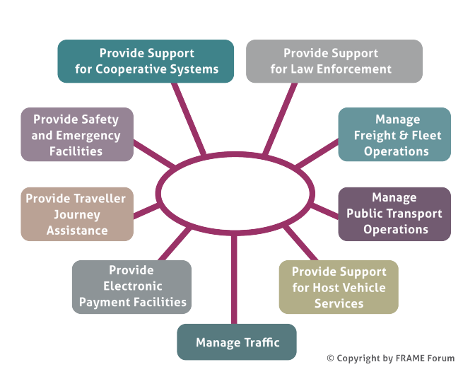
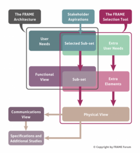

# FRAME Architecture version 4

!!! warning

    This Version is not supported any more!!

The FRAME Architecture now contains the Cooperative Systems services and applications developed by the COOPERS, CVIS and SAFESPOT FP6 Integrated Projects.  This extension now brings the total number of principal Functional Areas supported by the FRAME Architecture to nine, as shown below. A document containing a brief summary of the contents of each Functional Area can be found in download.

The presentation of the User Needs in the Browsing and Selection Tools can be difficult to read en masse, and a so a fully formatted set can be found in download.

## Overview

The following is an overview of how the Selection Tool is intended to be used.

When creating a bespoke ITS Architecture from the FRAME Architecture the architecture team needs to select a sub-set of the FRAME Architecture and, possibly, add some extra functionality that us not currently present. This process is supported by the FRAME Selection Tool which contains a database with all the elements of the FRAME Architecture, and to which more can be added. This is illustrated in the following figure.

## Download Area
The FRAME Selection Tool
FRAME Database
User Manual
Reference Manual

### System Requirements
The Selection Tool should run on any PC with Windows XP, Windows Vista, Windows 7, Windows 8 or Windows 10.

The Selection Tool won’t work with Office 2016, and in that case the Access 2010 Engine should be downloaded.

