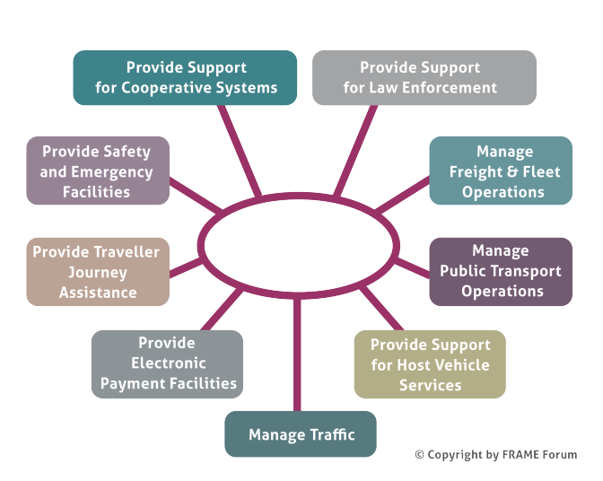

# FRAME Models

When creating a bespoke ITS Architecture from the FRAME Architecture the architecture team needs to select a sub-set of the FRAME Architecture and, possibly, add some extra functionality that us not currently present. This process is supported by the FRAME Tool which contains a database with all the elements of the FRAME Architecture, and to which more can be added. This is illustrated in the following figure.

There are TWO version of the FRAME Tool, version 4 and 5.

-   :fontawesome-brands-markdown:{ .lg .middle } __Frame Architecture v5__ 

    ---

    The FRAME Architecture, version 5, extends the traveller information services by the essential services promoted by the ITS Directive. [:octicons-arrow-right-24:](frame-architecture-5.md)

-   :material-format-font:{ .lg .middle } __Frame Architecture v4__ 

    ---

    The FRAME Architecture, version 4, contains the Cooperative Systems services and applications developed by the COOPERS, CVIS and SAFESPOT FP6 Integrated Projects.  This extension now brings the total number of principal Functional Areas supported by the FRAME Architecture to nine. [:octicons-arrow-right-24:](frame-architecture-4.md)

